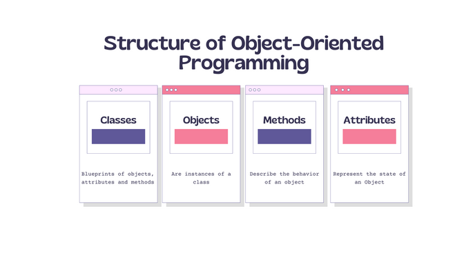
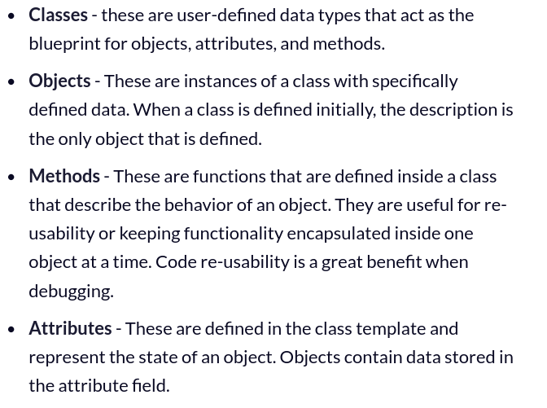

# Object Oriented Programming
#
## repos auf GitHub (Unterricht)
- 
- 
## useful links:
- [feecodecamp](https://www.freecodecamp.org/news/what-is-object-oriented-programming/)
#
## structure of OOP

- With OOP we can group related information together so that we can produce shorter and more reusable code. 

- That's where the building blocks come in to help us do this by using Classes, Objects, Methods and Attributes.

- Let's take a deep dive and understand what exactly these building blocks are:
