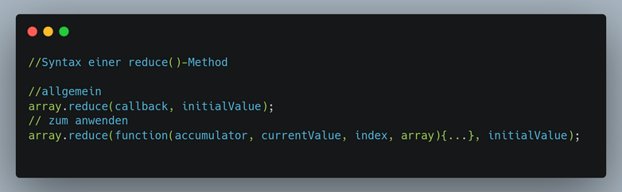
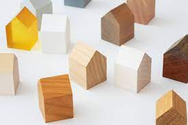
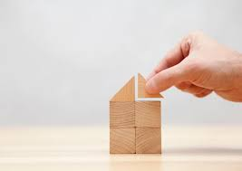

# Die reduce-Methode visualisiert
- Quelle: repo -> programming-basic -> /recap-higher-array-methods/
- in [README](https://github.com/dci-fbw-wd-tz-24-d01/programming-basic/tree/main/recap-higher-array-methods): 
#
## Stell dir vor, wir bauen ein Haus aus Bauklotzen

## die Bausteine sind die Elemente (z.B. {objects}) in einem [array]. In der Methode sind das die ***Current Value***s.
- 
#
## Das Bauwerk wird gebaut und immer größer; das ist der ***Accumulator***:
- 
#
## Optional fängt man an mit einer Fundierung / Grundgerüst. Das wäre der ***Initial Value***: 
- 
#